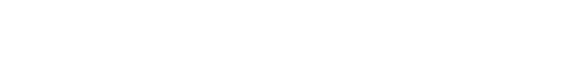

[](https://github.com/randorm)

> We have put together some guidelines for those times when you want to use our
> logos to link back to us.

## Structure

Repository contains Randorm's design code, including:

| Group                      | Description                                        |
| -------------------------- | -------------------------------------------------- |
| [icon](./icon/)            | Square icon with the letter `R` in the middle.     |
| [logo](./logo)             | Full-size rectangular `RANDORM` logo.              |
| [short-logo](./short-logo) | A shortened version of the logo with a single `R`. |

All files are named according to the following format:

```
<group: "icon" | "logo" | "short-logo">-<background color: "b" | "t" | "w">-<color: "b" | "w">.<file extension: "png" | "svg">
```

Where the letters `b`, `t`, and `w` stand for:

| Abbreviation | Description |
| ------------ | ----------- |
| `b`          | Black       |
| `t`          | Transparent |
| `w`          | White       |

## Usage

Do these awesome things:

1. Use a permitted Randorm logo to link to Randorm.

2. Use the Randorm logo in a blog post or news article about Randorm.

3. Use the permitted Randorm logos less prominently than your own company or
   product name or logo.

Please don’t do these things:

1. Do not use the Randorm name or any Randorm logo in a way that suggests you
   are Randorm, your offering or project is by Randorm, or that Randorm is
   endorsing you or your offering or project.

2. Do not use any Randorm logo as the icon or logo for your
   business/organization, offering, project, domain name, social media account,
   or website.

3. Do not modify the permitted Randorm logos, including changing the color,
   dimensions, or combining with other words or design elements.

4. Do not use Randorm trademarks, logos, or artwork without Randorm’s prior
   written permission.

## Legal

In short, the Randorm logos represent only Randorm and should not be used to
represent you or your projects, products, or company.
